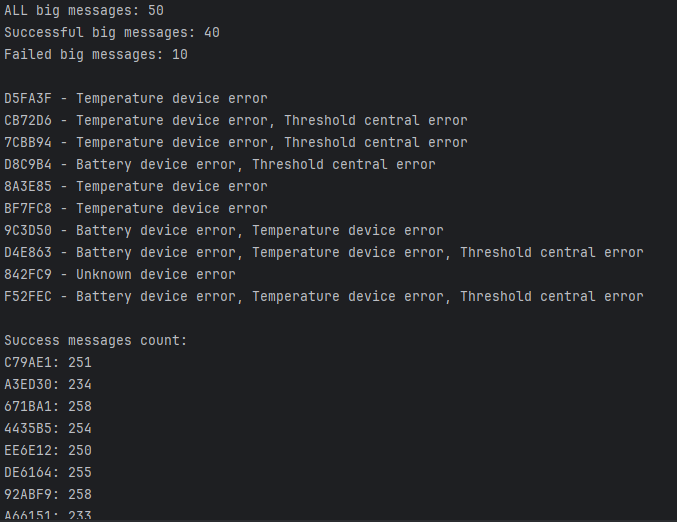

# Log File Parser
This Python script processes log files 
containing sensor data
and analyzes successful and failed sensor messages.

## Requirements

Python 3.10+

## Installation
Clone the repository:

```bash
git clone https://github.com/KKvladys/test_task_ajax
cd test_task_ajax
```
## Usage
Run the script
```bash
python src/sensor_log_parser.py
```
or in Docker
```bash
docker build -t sensor_log_parser .
```
```bash
docker run --rm sensor-log-parser
```

## Configuration
The script defines constants for sensor states and error codes.  
example of parsing strings - BIG;47;CD7B0A;1;66;42;7538;1;2;77;5;0;0;651;1;-2231;1;02

```python
SENSOR_ID_INDEX = 2
STATE_INDEX = -1
S_P1_INDEX = 6
S_P2_INDEX = 13

SENSOR_STATE_OK = "02"
SENSOR_STATE_FAILED = "DD"

ERROR_CODES = {
    0: "Battery device error",
    1: "Temperature device error",
    2: "Threshold central error"
}
```

## Result parse app_2.log file


---
# QR Code Scanner Handler Tests

Tests for the `CheckQr` class, which 
processes QR codes and validates their length, 
color, and database existence.

## Tested

- **QR Code Length and Color Mapping (`check_len_color`)**  
  - Ensures that QR codes of valid length return the expected color.
  - Invalid QR codes return `None`.

- **Database Validation (`check_scanned_device`)**  
  - If the QR code is **not found** in the database, an error message is sent.
  - If the QR code has an **invalid length**, an appropriate error is triggered.
  - If the QR code **exists**.

### Run tests
```bash
pytest
```
